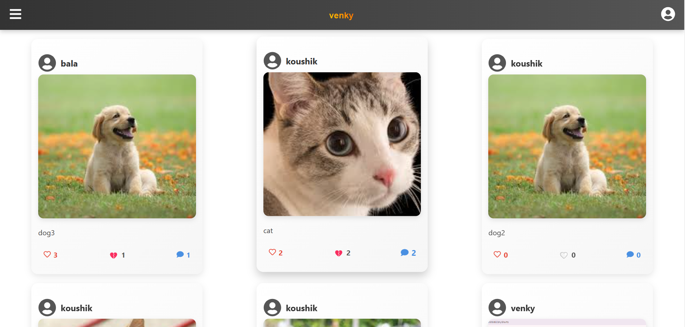
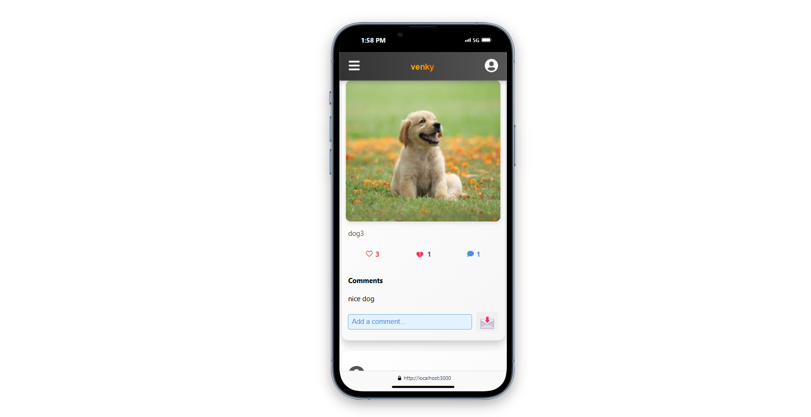
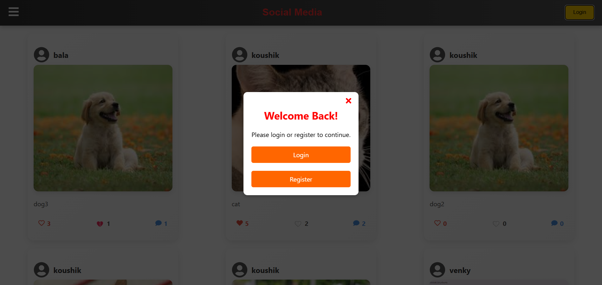

# 📱 Social Media App

This is a **MERN Stack** Social Media project where users can post, like, dislike, and comment on posts.

## 🚀 Features
- 📝 **Create Posts** – Users can write posts and upload images.
- ❤️ **Like & Dislike** – React to posts with likes or dislikes.
- 💬 **Comment** – Engage with posts by adding comments.
- 👥 **User Authentication** – Secure login and signup system.
- 📂 **Profile Management** – Users can manage their profiles.

## 🛠️ Tech Stack
- **Frontend:** React.js, CSS  
- **Backend:** Node.js, Express.js  
- **Database:** MongoDB  
- **Authentication:** JWT  
- **Hosting:** (Mention if deployed)

## 📸 Screenshots
  
  
  
  

## 📂 Setup & Installation
```bash
# Clone the repository
git clone https://github.com/kitkatvenkat/Social-media.git

# Navigate to the project directory
cd Social-media

# Install dependencies
npm install

# Start the frontend
npm start

# Navigate to backend folder
cd backend

# Install backend dependencies
npm install

# Start the backend server
npm run server
